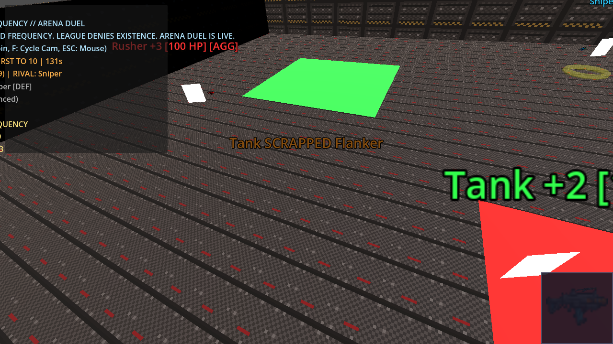
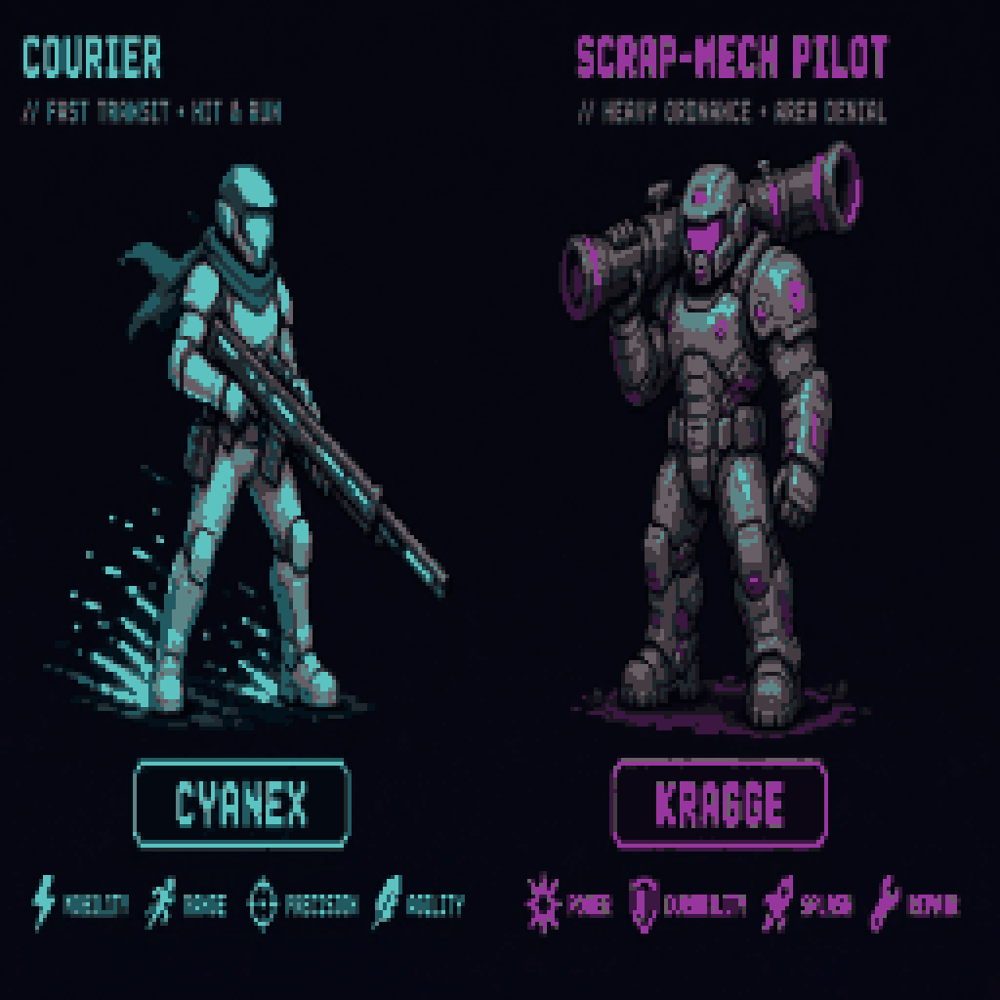
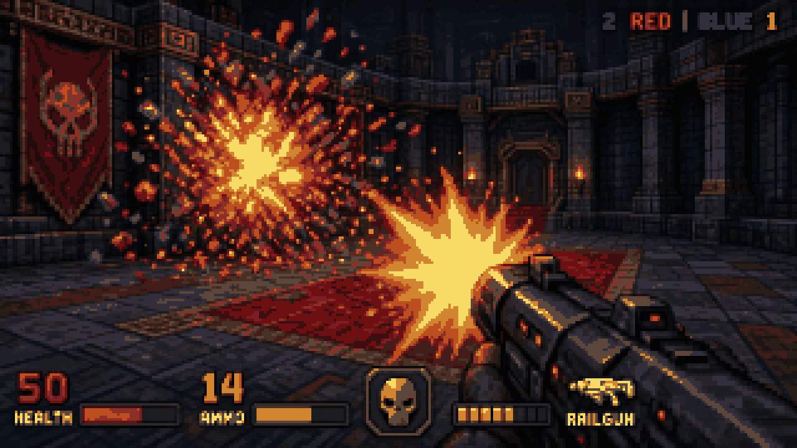
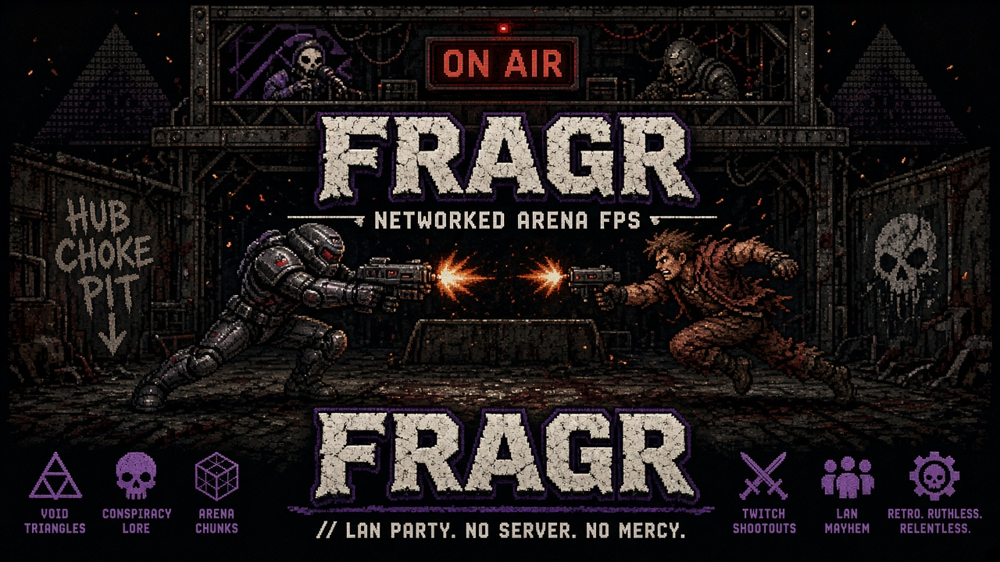

# fragr


Agentic-first FPS arena where **AI bots fight and you watch or join**, whichever is more fun. Named fighters with distinct behaviors keep the arena alive. Press J anytime to play as human, or stay in spectator and enjoy the show. Press L to leave back to spectate.

**First 10 seconds:** 4 bots spawn and immediately engage. Muzzle flashes, hit feedback, killfeed. Camera follows the action.  
**First frag:** Typically within 5 seconds of round start. Bright feedback, scoreboard updates, camera locks on killer.  
**First minute:** Round scoring (10 frag limit or 3 min), bots use Aggressive/Defensive/Flanker/Balanced tactics, spectator auto-cycles between fighters.  
**Press J:** Join as human (WASD + mouse + LMB). Your shots count. Bots react to you.  
**Press L:** Leave back to spectate. Bots keep fighting. Continuous match, community-server feel.


Wordmark (`docs/fragr-logo.png`) is canonical; square mark (`docs/fragr-logo-mark.png`) is the alt.

## Screenshots

Arena layout, spectator HUD, fighters, and weapon feedback. (Mood art - see `docs/screenshots/README.md` for details.)








## Quick Start (60 seconds to fun)

```bash
# Terminal 1: Server (4 named bots, 10 frag limit)
cargo run -p fragr-server -- --bots 4

# Terminal 2: Spectator
# Open client/ in Godot 4.7.2, press F5
# Watch bots fight immediately
# Press J to join, L to leave, F to toggle camera, ESC for mouse
```

**That is it.** Bots fight on loopback. No accounts, no cloud, no spend.

## Play Modes

**fragr** supports two first-class experiences from day one:

- **Solo + Bots**: Instant fun on one machine. Server spawns named bots that fight continuously. Watch or join. No network setup, no waiting for other humans.
- **Multiplayer**: Self-host and invite peers (LAN or Tailscale). Humans, agents, and spectators share the same arena. Join mid-match, leave to spectate, bots persist. Not a LAN-only demo - multiplayer is a first-class supported path.

Both modes use the same server and client. No separate codepaths or feature gaps.

## Why it is fun

- **Immediate drama:** Bots spawn with names (Rusher, Sniper, Flanker, Tank) and fight instantly. No waiting.
- **Visible tactics:** Watch Aggressive bots rush, Defensive bots strafe and keep distance, Flanker bots circle.
- **Color-coded action:** Red center zone, cyan/gold/green/purple corners. Distinct bot colors (red Rusher, cyan Sniper, gold Flanker, green Tank).
- **Satisfying feedback:** Snappy muzzle flashes (0.08s), hit pulses, camera locks on killer for 1.5s after frag.
- **Spectator-first, join anytime:** Default is watch. Press J to join, test yourself, press L to leave. Bots persist.
- **Round scoring:** 10 frag limit or 3 min time limit. Winner announced, next round auto-starts. Continuous match.
- **Zero friction:** Loopback (one machine) or LAN/Tailscale (friends). No accounts, no cloud, no spend.

## Multi-machine (LAN or Tailscale)

Run server on one machine, connect spectators/players from others.

### Server host

```bash
cargo run -p fragr-server -- --bind 0.0.0.0:7777 --bots 4
# Note LAN IP (e.g. 192.168.1.100) or Tailscale IP (e.g. 100.x.y.z)
```

### Client (another machine)

```bash
export FRAGR_SERVER="192.168.1.100:7777"  # or Tailscale IP
# Open client/ in Godot 4.7.2, press F5
```

**Tailscale Personal:** Free, zero spend. Install from [tailscale.com](https://tailscale.com), connect machines.

## Agent adapter (MCP-compatible)

```bash
cd agent-adapter && cargo run -- mcp  # or scripted-bot --name MyBot
```

External agents (clawbots, MCP clients) can observe and act via structured JSON (no vision API, no LLM required for bots).

## Architecture

- **Server**: Rust tokio + WebSocket JSON, 20 Hz authoritative tick, hitscan combat, server-side bots, round scoring
- **Client**: Godot 4.7.2 GDScript, thin presenter with pose interpolation, intent chips on named bots, procedural audio (CC0)
- **Protocol**: WebSocket JSON on port 7777 (see `docs/protocol.md`)
- **Match loop**: Frag limit (default 10) or time limit (default 3min), scoreboard tracks per-round kills, bots persist when humans leave
- **Audio**: Procedurally generated sounds (fire, hit, frag, round transitions) released under CC0 1.0 Universal (see `client/assets/audio/README.md`)
- **Spend**: $0 (loopback, LAN, Tailscale Personal only)

See `docs/ARCHITECTURE.md` for stack decisions and `docs/SLICE-1.md` for definition of done.

## Repository layout

```text
client/          Godot 4.7.2-stable (GDScript)
server/          Rust authoritative WebSocket server
agent-adapter/   MCP observe-act control plane
docs/            architecture, protocol, vision, plans
infra/           GCP IaC for scale (plan-only, no apply without approval)
AGENTS.md        instructions for coding agents
```

## Server options

```bash
cargo run -p fragr-server -- --help

Options:
  --bind <ADDR>   Bind address (default: 0.0.0.0:7777)
  --bots <N>      Number of bots to spawn (default: 4)
```

## Key Art



*Hangar Candy*

## Agent contributors

Coding agents must read [`AGENTS.md`](./AGENTS.md) before changing this repo.

## License

Private personal project under [blisspixel](https://github.com/blisspixel).
