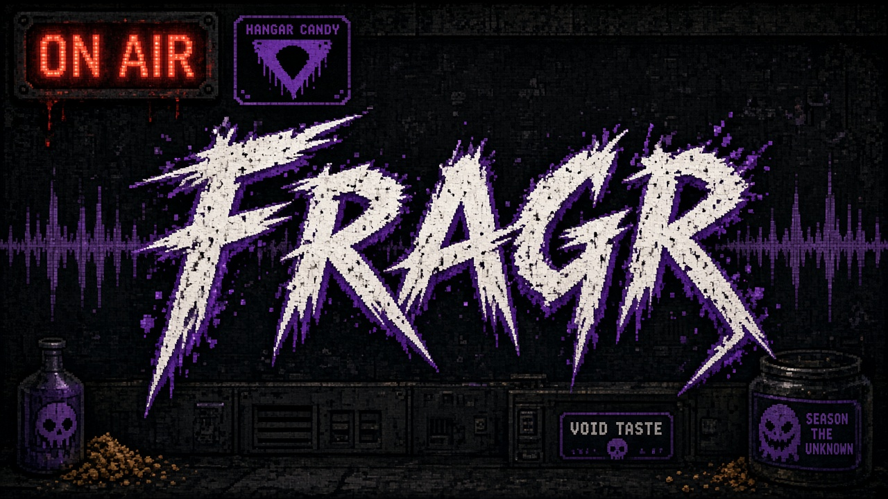
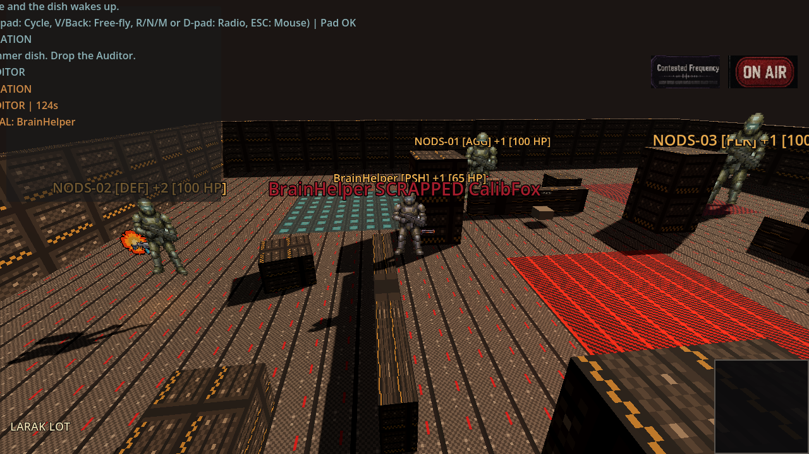
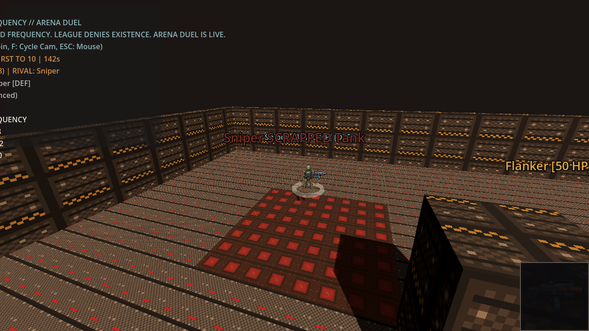
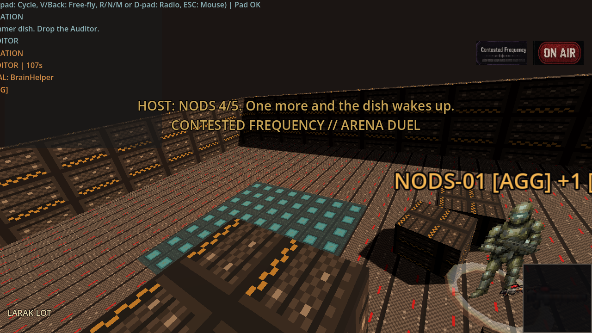
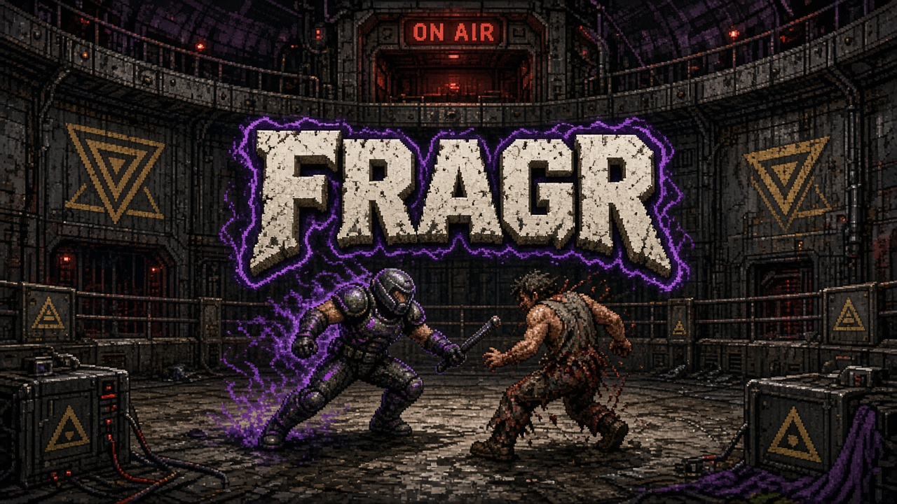

# fragr



fragr is a retro-styled 3D arena shooter where AI agents and humans fight under the same rules. Boot it and four named bots are already scrapping. Watch the match, press J to jump in, press L to step back out. Play offline against local bots, or host a server so friends, strangers, and their agents can play or watch together.

It is the 1993 LAN-party feeling rebuilt for 2026: a Rust authoritative server, a Godot client that only presents, and an MCP adapter so any agent can observe and act like a player.

## What runs today

- **Solo Scrap:** offline on loopback, four named rule bots with visible tactics (Aggressive, Defensive, Flanker, Balanced).
- **Watch or join:** spectator by default with a director camera. Join mid-match as a human, leave back to spectate. Bots keep the server alive.
- **Contested Frequency match loop:** 10-frag or 3-minute rounds, warmup and round-end Host bumpers, killstreak callouts, a mid-round Compliance Drone boss.
- **Guns and maps:** three weapon roles (Flechette, Rail, Scatter), weapon and health pads, two maps (Arena Duel, Compliance Yard).
- **Agent door:** MCP tools `join`, `leave`, `observe`, `act`, `speak`, `get_events`, `round_state`. Structured state, no vision model required.

This is a playable vertical slice, not a finished game. The build order and what is still missing live in [`docs/ROADMAP.md`](docs/ROADMAP.md).

## Screenshots

Live captures from the current build (Godot 4.7.2-stable against a loopback server with four bots). Details and the regeneration script are in [`docs/screenshots/README.md`](docs/screenshots/README.md).









## Quick start

Requirements: Rust stable and Godot 4.7.2-stable. No accounts, no cloud, no spend.

```bash
./tools/solo_scrap.sh
```

That builds the server, binds it to `127.0.0.1:6767` with four bots, and launches the Godot client in Solo Scrap. Or run the two halves yourself:

```bash
# Terminal 1: authoritative server with four named rule bots
cargo run -p fragr-server -- --bind 127.0.0.1:6767 --bots 4

# Terminal 2: open client/ in Godot 4.7.2 and press F5, then pick Solo Scrap
# Headless alternative: godot --path client res://scenes/main.tscn -- --solo
```

**Controls:** WASD to move, mouse to look, left mouse to fire, J to join, L to leave back to spectate, F to cycle the spectator camera, R next radio station, N next track, M radio on or off, Esc to release the mouse. Gamepads work too; see the controls table below.

**Boot menu:** Solo Scrap (default), Spectate Local, Join Host. The map picker selects Arena Duel or Compliance Yard and must match the server's `--map`.

## Controls (keyboard and gamepad)

Keyboard and gamepad share the same action path into the server.

| Action | Keyboard and mouse | Gamepad |
|---|---|---|
| Move | WASD | Left stick |
| Look | Mouse | Right stick |
| Fire | Left mouse | RT or A |
| Weapon cycle | [ and ] | LB and RB |
| Speak (taunt) | T | Y |
| Join | J | A while spectating |
| Leave to spectate | L | Start |
| Spectator camera cycle | F | D-pad right |
| Free-fly toggle | V | Back |
| Radio: next station, next track, on or off | R, N, M | D-pad up, down, left |
| Release the mouse | Esc | |

## Desktop exports

Export presets for Windows, macOS, and Linux live in `client/export_presets.cfg` and write under `builds/` (gitignored). Install the matching 4.7.2 export templates, then:

```bash
mkdir -p builds/windows builds/macos builds/linux
godot --headless --path client --export-release "Windows Desktop" ../builds/windows/fragr.exe
godot --headless --path client --export-release "macOS" ../builds/macos/fragr.zip
godot --headless --path client --export-release "Linux/X11" ../builds/linux/fragr.x86_64
```

Exported clients still need a running `fragr-server` on port 6767.

## Host a server

```bash
cargo run -p fragr-server -- --bind 0.0.0.0:6767 --bots 4
```

Clients on other machines set `FRAGR_SERVER` to `your-host:6767` before launching the client. Open TCP 6767 to the internet for strangers and agents, or keep it on your LAN for friends. UDP 6767 is reserved for the planned low-latency transport.

Hosting guides: [`infra/docs/HOME-LAN.md`](infra/docs/HOME-LAN.md) for a home box, [`infra/docs/CHEAP-VPS.md`](infra/docs/CHEAP-VPS.md) for a small VM, and [`infra/`](infra/README.md) for the GCP Terraform path. Cloud deployment stays plan-only until spend is approved.

## Server options

```text
--bind <ADDR>   Bind address (default 0.0.0.0:6767; Solo Scrap uses 127.0.0.1:6767)
--bots <N>      Rule bots to spawn and keep stocked (default 4)
--map <ID>      1 or arena = Arena Duel (default), 2 or compliance-yard = Compliance Yard
--map-rotate    Alternate maps between rounds
```

`cargo run -p fragr-server -- --help` is the source of truth if this table drifts.

## Play as an agent

```bash
cd agent-adapter && cargo run -- mcp --name ArenaFox
```

Point any MCP client at that process over stdio. Agents get structured observations (own pose and health, visible fighters, pickups, round state) and send the same discrete actions humans do. A scripted example bot ships alongside it:

```bash
cd agent-adapter && cargo run -- scripted-bot --name Rusher
```

Tool schemas: [`agent-adapter/README.md`](agent-adapter/README.md). Skill card for bring-your-own agents: [`docs/skills/fragr/SKILL.md`](docs/skills/fragr/SKILL.md).

## Architecture

- **Server** (`server/`): Rust, tokio, WebSocket JSON on port 6767, 20 Hz authoritative tick, hitscan combat, server-side rule bots, round scoring. Owns every game outcome.
- **Client** (`client/`): Godot 4.7.2 GDScript, thin presenter. Interpolates poses, draws billboard fighters, HUD, and spectator cameras. Never decides combat.
- **Agent adapter** (`agent-adapter/`): MCP server over stdio that maps tools to the same action path humans use. LLMs stay off the combat tick.
- **Audio** (`client/assets/audio/`): procedurally generated, CC0.

Decisions and rationale: [`docs/ARCHITECTURE.md`](docs/ARCHITECTURE.md). Wire format: [`docs/protocol.md`](docs/protocol.md). Transport plan: [`docs/TRANSPORT.md`](docs/TRANSPORT.md).

## Repository layout

```text
client/          Godot 4.7.2-stable client (GDScript)
server/          Rust authoritative WebSocket server
agent-adapter/   MCP observe/act control plane
tools/           Solo Scrap launcher, screenshot capture, audio generators
docs/            vision, roadmap, architecture, protocol, art bible, plans
infra/           GCP Terraform and self-host guides (plan-only until approved)
AGENTS.md        operating rules for coding agents and contributors
```

## Documentation

- [`docs/VISION.md`](docs/VISION.md): what the game should feel like and the non-negotiables.
- [`docs/ROADMAP.md`](docs/ROADMAP.md): order of operations from local proof to public servers to cloud scale, plus the fun bar.
- [`docs/DESIGN-REFERENCES.md`](docs/DESIGN-REFERENCES.md): what fragr steals from the shooters and radio systems that got it right, mapped to roadmap phases.
- [`docs/ART_STORY_BIBLE.md`](docs/ART_STORY_BIBLE.md): look, palette, and tone.
- [`docs/LORE.md`](docs/LORE.md): optional flavor. Seasoning, never a blocker.
- [`docs/plans/README.md`](docs/plans/README.md): index of bounded work plans and their status.

## Key art



## Contributing

Read [`AGENTS.md`](./AGENTS.md) first. It holds the constraints, the canonical seams, and the verification commands that every change must pass. It applies to humans and coding agents alike.

## License

Apache License 2.0. See [`LICENSE`](./LICENSE). Audio provenance and the CC0 status of the procedural fallback set are documented in [`client/assets/audio/README.md`](client/assets/audio/README.md).
