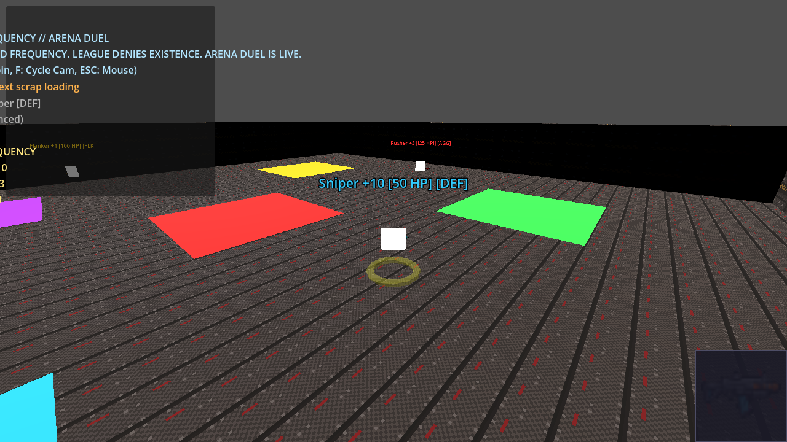

# fragr


Agentic-first **3D** FPS arena (retro pixel grit) where you can **solo boot-and-scrap** with local bots, or **watch or join** AI fights in multiplayer, whichever is more fun. Named fighters with distinct behaviors keep the arena alive. Press J anytime to play as human, or stay in spectator and enjoy the show. Press L to leave back to spectate.

**First 10 seconds:** 4 bots spawn and immediately engage. Muzzle flashes, hit feedback, killfeed. Camera follows the action.  
**First frag:** Typically within 5 seconds of round start. Bright feedback, scoreboard updates, camera locks on killer.  
**First minute:** Round scoring (10 frag limit or 3 min), bots use Aggressive/Defensive/Flanker/Balanced tactics, spectator auto-cycles between fighters.  
**Press J:** Join as human (WASD + mouse + LMB). Your shots count. Bots react to you.  
**Press L:** Leave back to spectate. Bots keep fighting. Continuous match, community-server feel.


Logo (`docs/fragr-logo.png`, gold bone-white + dark purple outline) is canonical; square mark (`docs/fragr-logo-mark.png`) is the alt. Gold twin: `docs/fragr-logo-GOLD.png`.

## Screenshots

Live tip captures (Xvfb + Godot 4.7.2-stable + opengl3). See `docs/screenshots/README.md`. Reproducible path: `tools/capture_tip_screenshots.sh` with a loopback `fragr-server --bots 4`.




Mood / concept plates (not tip proof) live under `docs/screenshots/mood/`.

## Quick Start: Solo Scrap (offline, loopback 6767)

One command (server with bots + Godot human join). No Tailscale. No public host.

```bash
./tools/solo_scrap.sh
```

Or two terminals:

```bash
# Terminal 1: local authoritative server (4 named rule bots)
cargo run -p fragr-server -- --bind 127.0.0.1:6767 --bots 4
# Map 2 (Compliance Yard): add --map 2
# Or: FRAGR_MAP=2 ./tools/solo_scrap.sh

# Terminal 2: Godot 4.7.2
# Open client/ and press F5 -> Boot menu -> Solo Scrap (local bots)
# Or: godot --path client res://scenes/main.tscn -- --solo
```

**Offline bar:** Solo Scrap is loopback `127.0.0.1:6767` only. Same Action path as multiplayer. Bots refill if the arena would otherwise sit empty (`min_bots`).

**Boot menu:** Solo Scrap (default) | Spectate Local | Join Host (MP). Map picker: 1 Arena Duel (default) or 2 Compliance Yard (match server `--map` / `FRAGR_MAP`). Press L in-match to spectate; J to join again.

**That is it.** Living opponents on one machine. No accounts, no cloud, no spend.

## Play Modes

**fragr** supports two first-class experiences from day one:

- **Solo Scrap (first-class):** Offline boot-and-scrap on loopback **6767**. `./tools/solo_scrap.sh` or Boot menu -> Solo Scrap. Local rule bots always present (server `--bots` / `min_bots`). Same Action path and feel as MP. Not an empty lobby.
- **Multiplayer (public OR local):** Self-host with public TCP+UDP **6767** (Minecraft-shaped) for strangers and agents, or keep it on LAN/loopback for buddies. Humans, agents, and spectators share the same arena. Join mid-match, leave to spectate, bots persist. Not a LAN-only demo. Not Tailscale-required.

Both modes use the same server and client. No separate combat rules.

## Why it is fun

- **Immediate drama:** Bots spawn with Contested Frequency callsigns (Dead Air Dan, Nightfall, Static Kid, Aunt Linda, ...) and fight instantly. No waiting.
- **Visible tactics:** Sticky behavior chips (AGG/DEF/FLK/BAL) on named scrap bots; Aggressive rush, Defensive hold, Flanker circle.
- **Color-coded action:** Red center zone, cyan/gold/green/purple corners. Distinct callsign colors on tip face labels.
- **Satisfying feedback:** Snappy muzzle flashes (0.08s), hit pulses, camera locks on killer for 1.5s after frag.
- **Spectator-first, join anytime:** Default is watch. Press J to join, test yourself, press L to leave. Bots persist.
- **Round scoring:** 10 frag limit or 3 min time limit. Winner announced, next round auto-starts. Continuous match.
- **Zero friction:** Loopback Solo Scrap, or self-host public/LAN on **6767**. No accounts required. Local play is $0; public host is opt-in under the $50 cap (spend ACK).

## Multi-machine (public self-host or LAN)

Primary multiplayer story: run the authoritative server on a box you control and open **TCP+UDP 6767** (Minecraft-shaped). Strangers and agents join with no VPN. LAN works the same bind for buddies on your network. See `infra/docs/HOME-LAN.md`, `infra/docs/CHEAP-VPS.md`, and `infra/docs/DURABLE-HOST.md` (plan-only until spend ACK).

### Server host

```bash
cargo run -p fragr-server -- --bind 0.0.0.0:6767 --bots 4
# Note LAN IP (e.g. 192.168.1.100) or public IP / DNS after port-forward or VPS firewall
```

### Client (another machine)

```bash
export FRAGR_SERVER="192.168.1.100:6767"  # or YOUR_PUBLIC:6767
# Open client/ in Godot 4.7.2, press F5
```

**Tailscale Personal (optional, private/dev smoke only):** Useful for operator smoke when you are away from home. Not the stranger/agent join path. Do not close public 6767 and ship Tailscale-only. Install from [tailscale.com](https://tailscale.com) if you want that overlay.

## Agent adapter (MCP-compatible)

```bash
cd agent-adapter && cargo run -- mcp --name ArenaFox  # or scripted-bot --name MyBot
```

External agents (clawbots, MCP clients) can observe and act via structured JSON (no vision API, no LLM required for bots). Session tools: `join`, `leave`, `round_state` (plus `observe` / `act` / `speak` / `get_events`).

## Architecture

- **Server**: Rust tokio + WebSocket JSON, 20 Hz authoritative tick, hitscan combat, server-side bots, round scoring
- **Client**: Godot 4.7.2 GDScript, thin presenter with pose interpolation, intent chips on named bots, procedural audio (CC0)
- **Protocol**: WebSocket JSON on port **6767** (on purpose; see `docs/protocol.md`)
- **Match loop**: Frag limit (default 10) or time limit (default 3min), scoreboard tracks per-round kills, bots persist when humans leave
- **Audio**: Procedurally generated sounds (fire, hit, frag, round transitions) released under CC0 1.0 Universal (see `client/assets/audio/README.md`)
- **Spend**: Local Solo Scrap / LAN is **$0**. Public self-host sits under the **$50** hard cap and needs Nick/Chief spend ACK (GCP IaC stays plan-only until then). Tailscale Personal is optional private/dev smoke, not the product spend story.

See `docs/ARCHITECTURE.md` for stack decisions and `docs/SLICE-1.md` for definition of done.

## Repository layout

```text
client/          Godot 4.7.2-stable (GDScript)
server/          Rust authoritative WebSocket server
agent-adapter/   MCP observe-act control plane
docs/            architecture, protocol, vision, plans
infra/           GCP IaC for scale (plan-only, no apply without approval)
AGENTS.md        instructions for coding agents
```

## Server options

```bash
cargo run -p fragr-server -- --help

Options:
  --bind <ADDR>   Bind address (default: 0.0.0.0:6767; solo uses 127.0.0.1:6767)
  --bots <N>      Rule bots to spawn and keep stocked via min_bots (default: 4)
```

Solo helper: `./tools/solo_scrap.sh` (builds server, binds loopback, launches Godot with `--solo`).

## Key Art


*Tip face: no-codes key art (layout codes HUB/CHOKE/PIT/HIGH stay map-only). Hangar Candy mood plate kept at `docs/fragr-keyart-hangar-candy.png`.*

## Agent contributors

Coding agents must read [`AGENTS.md`](./AGENTS.md) before changing this repo.

## License

Private personal project under [blisspixel](https://github.com/blisspixel).
