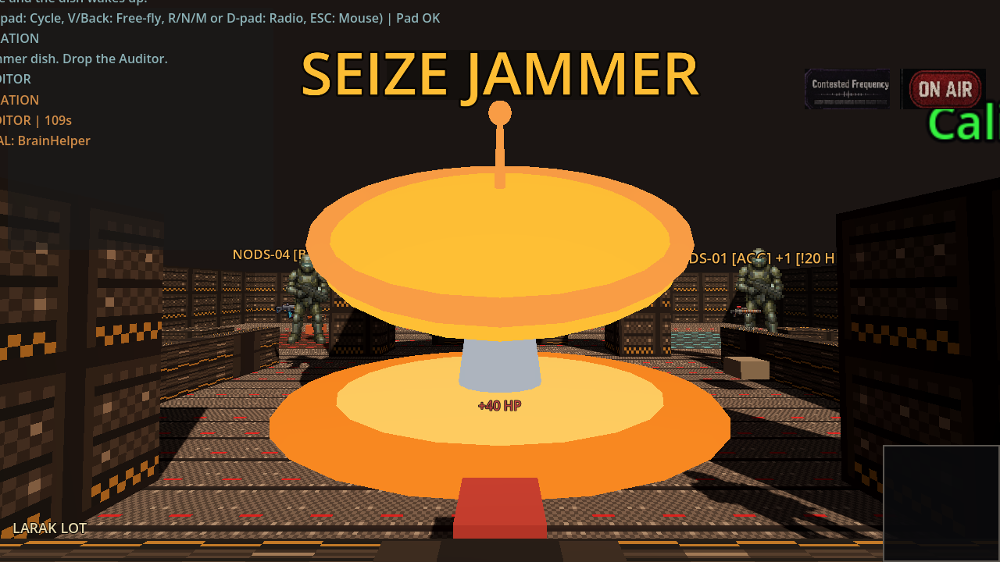

# fragr docs/screenshots

## Current status: live tip captures + archived mood plates

Tip embeds show the **v0.13.0 hangar / guns** face: jammer dish in the live hangar (SEIZE JAMMER, LARAK LOT chip, Hangar Candy chrome strip off), weapons and frags that kill, Join FP scrap juice, Contested Frequency spectator HUD. Captured with Godot 4.7.2-stable under Xvfb + opengl3 against a loopback `fragr-server --bots 4 --solo-broadcast` via `tools/capture_tip_screenshots.sh` on tip after #125.

Archived mood / concept plates remain under `mood/` for vision direction only. Do not treat mood plates as tip gameplay proof.

## Standing rule

README screenshots MUST match the current playable UI. Stale mood stubs labeled as tip gameplay are forbidden. README front door leads with hangar dish + guns, not Episode 0 title chrome alone.

## Tip captures (current)

| File | Aspect | Purpose |
|------|--------|---------|
| `20_jammer_dish_follow_16x9.png` | 16:9 | Live tip: jammer dish at follow (~12m), SEIZE JAMMER, LARAK LOT |
| `22_jammer_dish_overview_16x9.png` | 16:9 | Live tip: jammer dish at overview (~36m) in hangar |
| `23_jammer_dish_seize_label_16x9.png` | 16:9 | Live tip: SEIZE JAMMER label read under HUD |
| `09_tip_weapons_frags_16x9.png` | 16:9 | Live tip: weapons / muzzle / killfeed combat still |
| `10_tip_human_join_fp_16x9.png` | 16:9 | Live tip: Join FP scrap juice (crosshair + weapon face) |
| `01_arena_overview_16x9.png` | 16:9 | Live tip: arena + Contested Frequency HUD / scoreboard |
| `02_spectator_hud_16x9.png` | 16:9 | Live tip: Host compliance bumper + pressure chip + scoreboard |
| `07_tip_compliance_pressure_16x9.png` | 16:9 | Live tip: mid-round scrap with killfeed + Contested Frequency |
| `08_tip_host_flash_midjoin_16x9.png` | 16:9 | Live tip: mid-join Host bumper flash from first Active Snapshot |
| `11_tip_warmup_tv_bumper_16x9.png` | 16:9 | Live tip: Warmup Contested Frequency TV bumper (Larak Lot face) |
| `12_tip_calibration_larak_16x9.png` | 16:9 | Live tip: Solo Broadcast Calibration chrome on Larak Lot (secondary; not README lead) |

Recaptured on tip `cc4eff9` (#125 live tip_capture hangar dish + Hangar Candy dual chip gone; #124 guns that kill) via `tools/capture_tip_screenshots.sh`. README tip gallery leads with dish + weapons.

## Jammer dish proof (stranger eyes)

Studio void `capture_jammer_dish_proof.sh` is harness-only. Tip face is the live hangar stills above (20 / 22 / 23). Hangar Candy chrome strip is off on Larak Lot. No dish-claim tag until Testy re-Casino.

## Mood plates (archived)

| File | Aspect | Purpose |
|------|--------|---------|
| `mood/01_arena_overview_16x9.png` | 16:9 | Hub/choke arena layout concept |
| `mood/02_spectator_hud_16x9.png` | 16:9 | Spectator HUD concept |
| `mood/03_fighters_cyanex_kragge_1x1.png` | 1:1 | Fighter characters concept |
| `mood/04_muzzle_juice_16x9.png` | 16:9 | Weapon feedback concept |
| `mood/05_weapon_icons_1x1.png` | 1:1 | Weapon icon concepts |
| `mood/06_map_callouts_16x9.png` | 16:9 | Map callout concepts |

Boomer-arena energy. **No Doom IP.**

## How to regenerate tip captures

1. Launch server: `cargo run -p fragr-server -- --bind 127.0.0.1:6767 --bots 4 --solo-broadcast`
2. Put Godot 4.7.2-stable on PATH as `godot` (or `Godot_v4.7.2-stable_linux.x86_64`)
3. Run `tools/capture_tip_screenshots.sh` (Xvfb + opengl3; sets `LIBGL_ALWAYS_SOFTWARE=1` by default)
4. Inspect PNGs: dish in hangar with SEIZE JAMMER, LARAK LOT chip, no Hangar Candy strip beside it, Contested Frequency / guns / Join FP; no pink frames
5. Keep mood plates under `mood/`; do not re-label them as tip

Live captures must show what currently runs. No aspirational features. No concept art labeled as gameplay.

## Tip screenshot capture plan

See [`../plans/tip-screenshots.md`](../plans/tip-screenshots.md) and [`../plans/tip-stills-hangar-guns.md`](../plans/tip-stills-hangar-guns.md).

## Hangar dish (README lead)

Live tip_capture hangar: chunky SEIZE JAMMER dish at follow distance, LARAK LOT chip, Contested Frequency + ON AIR only.

## Weapons / frags

Combat still with held weapons, killfeed, hangar scrap.

## Human join FP juice

Join-mode first-person scrap juice: crosshair, held-weapon face, Contested Frequency.

## Calibration / Larak Lot (secondary)

Solo Broadcast Episode 0 chrome. Kept in the tip table; not the README front-door lead after v0.13.0 hangar / guns face.
