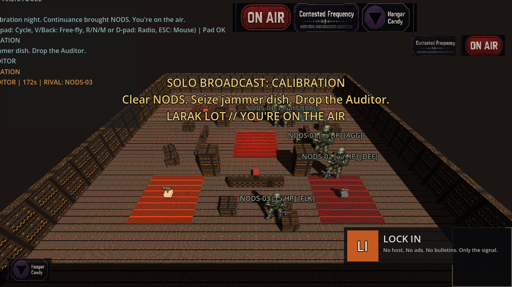
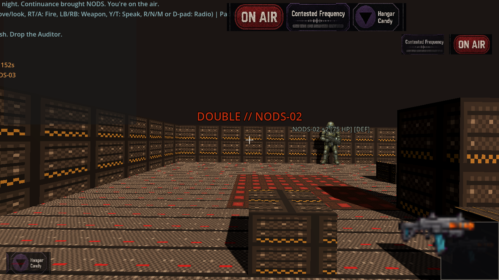
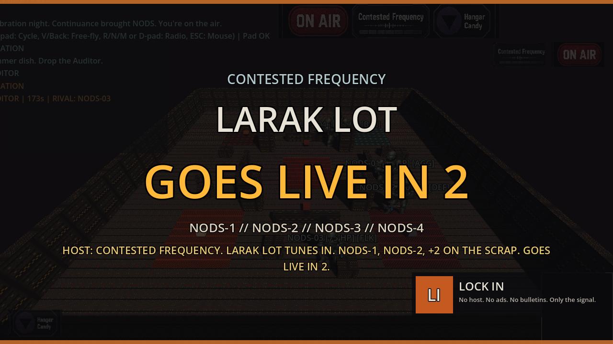

# fragr docs/screenshots

## Current status: live tip captures + archived mood plates

`01_arena_overview_16x9.png`, `02_spectator_hud_16x9.png`, `07_tip_compliance_pressure_16x9.png`, `08_tip_host_flash_midjoin_16x9.png`, `09_tip_weapons_frags_16x9.png`, `10_tip_human_join_fp_16x9.png`, `11_tip_warmup_tv_bumper_16x9.png`, and `12_tip_calibration_larak_16x9.png` are **live tip captures** from Godot 4.7.2-stable under Xvfb + opengl3 against a loopback `fragr-server --bots 4 --solo-broadcast`. They show Solo Broadcast Episode 0 (Calibration / Larak Lot) chrome, Contested Frequency spectator HUD, Warmup TV bumper, Host flash on mid-join, weapons/frags combat, and Join FP scrap juice. Regenerated after Episode 0 so tip embeds match tip face.

Archived mood / concept plates remain under `mood/` for vision direction only. Do not treat mood plates as tip gameplay proof.

## Standing rule

README screenshots MUST match the current playable UI. Stale mood stubs labeled as tip gameplay are forbidden.

## Tip captures (current)

| File | Aspect | Purpose |
|------|--------|---------|
| `12_tip_calibration_larak_16x9.png` | 16:9 | Live tip: Solo Broadcast Calibration title + objective on Larak Lot |
| `01_arena_overview_16x9.png` | 16:9 | Live tip: arena + Contested Frequency HUD / scoreboard |
| `02_spectator_hud_16x9.png` | 16:9 | Live tip: Host compliance bumper + pressure chip + scoreboard |
| `07_tip_compliance_pressure_16x9.png` | 16:9 | Live tip: mid-round scrap with killfeed + Contested Frequency |
| `08_tip_host_flash_midjoin_16x9.png` | 16:9 | Live tip: mid-join Host bumper flash from first Active Snapshot |
| `09_tip_weapons_frags_16x9.png` | 16:9 | Live tip: weapons / muzzle / killfeed combat still |
| `10_tip_human_join_fp_16x9.png` | 16:9 | Live tip: Join FP scrap juice (crosshair + weapon face) |
| `11_tip_warmup_tv_bumper_16x9.png` | 16:9 | Live tip: Warmup Contested Frequency TV bumper (Larak Lot face) |

Recaptured on tip after Solo Broadcast Episode 0 via `tools/capture_tip_screenshots.sh`. `12_tip_calibration_larak` is a first-class tip embed.

## Mood plates (archived)

| File | Aspect | Purpose |
|------|--------|---------|
| `mood/01_arena_overview_16x9.png` | 16:9 | Hub/choke arena layout concept |
| `mood/02_spectator_hud_16x9.png` | 16:9 | Spectator HUD concept |
| `mood/03_fighters_cyanex_kragge_1x1.png` | 1:1 | Fighter characters concept |
| `mood/04_muzzle_juice_16x9.png` | 16:9 | Weapon feedback concept |
| `mood/05_weapon_icons_1x1.png` | 1:1 | Weapon icon concepts |
| `mood/06_map_callouts_16x9.png` | 16:9 | Map callout concepts |

Boomer-arena energy. **No Doom IP.**

## How to regenerate tip captures

1. Launch server: `cargo run -p fragr-server -- --bind 127.0.0.1:6767 --bots 4 --solo-broadcast`
2. Put Godot 4.7.2-stable on PATH as `godot` (or `Godot_v4.7.2-stable_linux.x86_64`)
3. Run `tools/capture_tip_screenshots.sh` (Xvfb + opengl3; sets `LIBGL_ALWAYS_SOFTWARE=1` by default)
4. Inspect PNGs: Calibration / Larak Lot objective chrome, Contested Frequency title, scoreboard/killfeed/Host bumpers; no pink frames
5. Keep mood plates under `mood/`; do not re-label them as tip

Live captures must show what currently runs. No aspirational features. No concept art labeled as gameplay.

## Tip screenshot capture plan

See [`../plans/tip-screenshots.md`](../plans/tip-screenshots.md) and [`../plans/tip-stills-ep0.md`](../plans/tip-stills-ep0.md).

## Calibration / Larak Lot

Solo Broadcast Episode 0 title card: Calibration, objective chip, Larak Lot on-air line.

## Human join FP juice

Join-mode first-person scrap juice: crosshair, held-weapon face, spawn/damage flash overlays on Contested Frequency.

## Warmup TV bumper

Full-frame Contested Frequency Warmup: Larak Lot title, roster callsigns, giant GOES LIVE IN N, Host flash.
